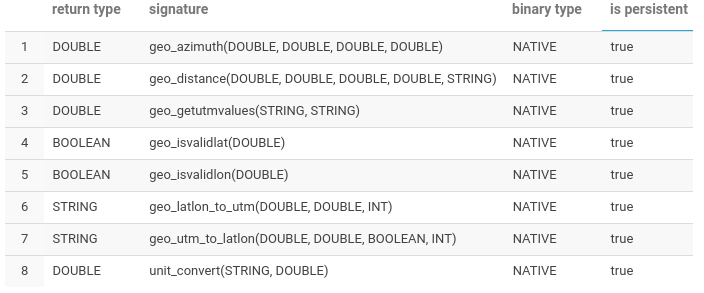

## liblocation - Native C++ UDF library for Apache Impala

It is a minimal library of functions related to Geo localization
to be used directly in SQL statements in Apache Impala.

The library is made up of UDF's written in C++ and compiled
natively in the Cloudera Quickstart 5.13 environment.
The functions are mathematically correct and can be used in the most varied cases to which they apply.

As for performance, we were unable to test them with thousands or more geographic data. However, given the characteristics inherent to the development model, a performance compatible with Impala is expected.

This project is still in its early stages of development and I hope to be able to improve it as much as possible.

An objective that we greatly appreciated during development was
that we can contribute so that more people can understand
how UDF's in C++ can be programmed for use in Apache Impala and take advantage the best of this technique.

We use Cloudera Quickstart for all our studies on the Hadoop ecosystem. With a special focus on Impala, HBASE and Flume.

## UDF's

Calculates the distance between two point given their geographical coordinates, latitude and longitude. Use Haversine formula. The coordinate fields must be informed decimal degrees. 
_double g_distance(double lat_a,double lon_a ,double lat_b, double lon_b, string unit);_

Calculate the azimuth from latitude and longitude.The coordinate fields must be informed decimal degrees. 
_double g_azimuth(double lat_a,double lon_a ,double lat_b, double lon_b);_

Check if latitude is in valid range: [-90,90]. Use: Lat/Lon [-/+] decimal degrees. 
_boolean geo_isvalidlat(double lat);_

Check if longitude is in valid range: [-180,180]. Use: Lat/Lon [-/+] decimal degrees. 
_boolean geo_isvalidlon(double lon);_

**Note:** C++ UDFs in Impala cannot have complex types variable arguments such as ARRAY, MAP or STRUCT. Thus we return a string in json format with the calculated values in order to overcome this limitation.

Converts geographic coordinates latitude and longitude to UTM equivalents (Universal Transverse Mercator) in meters. 
Returns a Json-formatted string as follow: 
_{   "LatLonToUTMXY":{
     "xE":"508115.914296",
      "yN":"9434849.847182",
      "zone":"33"
}_ 
_string geo_latlon_to_utm(double lat ,double lon, int zone);_

Converts the UTM x and y coordinates to the corresponding longitude and latitude. 
Returns a Json-formatted string as follow: 
_{   "UTMXYToLatLon":{
     "lat":"any value in decimal",
     "lat":"any value in decimal",
     "zone":"33"
}_ 
_string geo_utm_to_latlon(double x,double y ,boolean, int zone);_

Returns 'x' Easting or 'y' Northing value of UTM coordinate and zone. 
Arguments: 
field: "x" | "y" | "z". 
json: _{   "LatLonToUTMXY":{
     "xE":"508115.914296",
      "yN":"9434849.847182",
      "zone":"33"
}_ 
e.g: 
select geo_getutmvalues('x', '{   "LatLonToUTMXY":{
     "xE":"508115.914296",
      "yN":"9434849.847182",
      "zone":"33"
}'); 
Returns: 508115.914296  
_double geo_getutmvalues(string field, string json_string) ;_

Convenience function to convert between some measurement units. 
Arguments:
cnv: kmh_to_mih | mih_to_kmh | mi_to_meters | meters_to_mi | feet_to_meteres | meters_to_feet.
unit_val: Value to be converted 
e.g: 
select unit_convert("kmh_to_mih", 100); 
Returns:  62.1371 
select unit_convert("kmh_to_mih", velocity); 

_double unit_convert(string cnv, double unit_val);_

## Instructions

In Cloudera Quickstart, by default, the user's folder is located in __/user/cloudera__, so we will assume this path for the steps below:

### To compile liblocation

cd /user/cloudera 
git clone   
cd liblocation  
make  

### To copy to HDFS
hdfs dfs -mkdir -p /user/cloudera/impala_udf  
hdfs dfs -put -f  lib/liblocation.so /user/cloudera/impala_udf 

### Create UDF's

To create (register) the UDF's in the Impala metastore so that we can use them, we will use the DDL's that are encoded in the __doc/impala-create-funcs.sql__ file.

__Important:__
The functions haven't a global scope, they are created and related to the database in use.

__HUE:__

Create a database or use the *default* database and copy the DDL's in the HUE and execute them.
If there is no error message, run the show functions command. The output should be the same as shown below.

_show functions;_ 

Note the _binary type_ and _is persistent_ column. 
Binary type: indicates the type of registered library, in our case is 'native', i.e. a shared library (.so). 
is persistent: if 'true' it is a function registered in the metastore permanently.

__Line command:__ Using impala-shell.

impala-shell -f doc/impala-create-funcs.sql

impala-shell: _show functions;_ 

